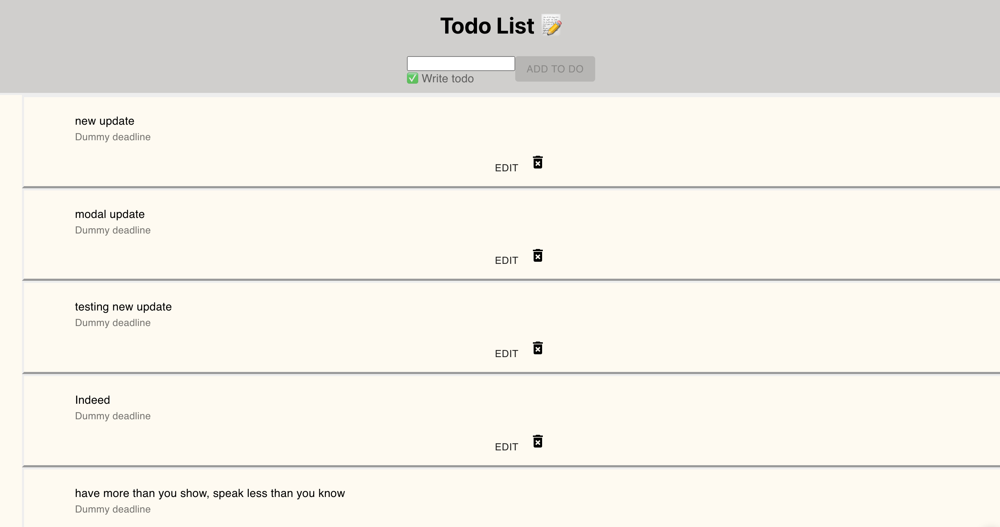

# To-do-list---REACT
Beginner level react application in which the user will be able to create a to do list for an every day task.
This application is built with the help of REACT - JSX - HTML - CSS.
App has full CRUD functionality (Create,Read,Update & Delete).
Material-Ui was used for design (front end).
Hosted online (firebase),
Firebase is used as a Real time database.
React Hooks were used.
In order to run this project locally within your machine CD into the SRC file and run "npm start".

